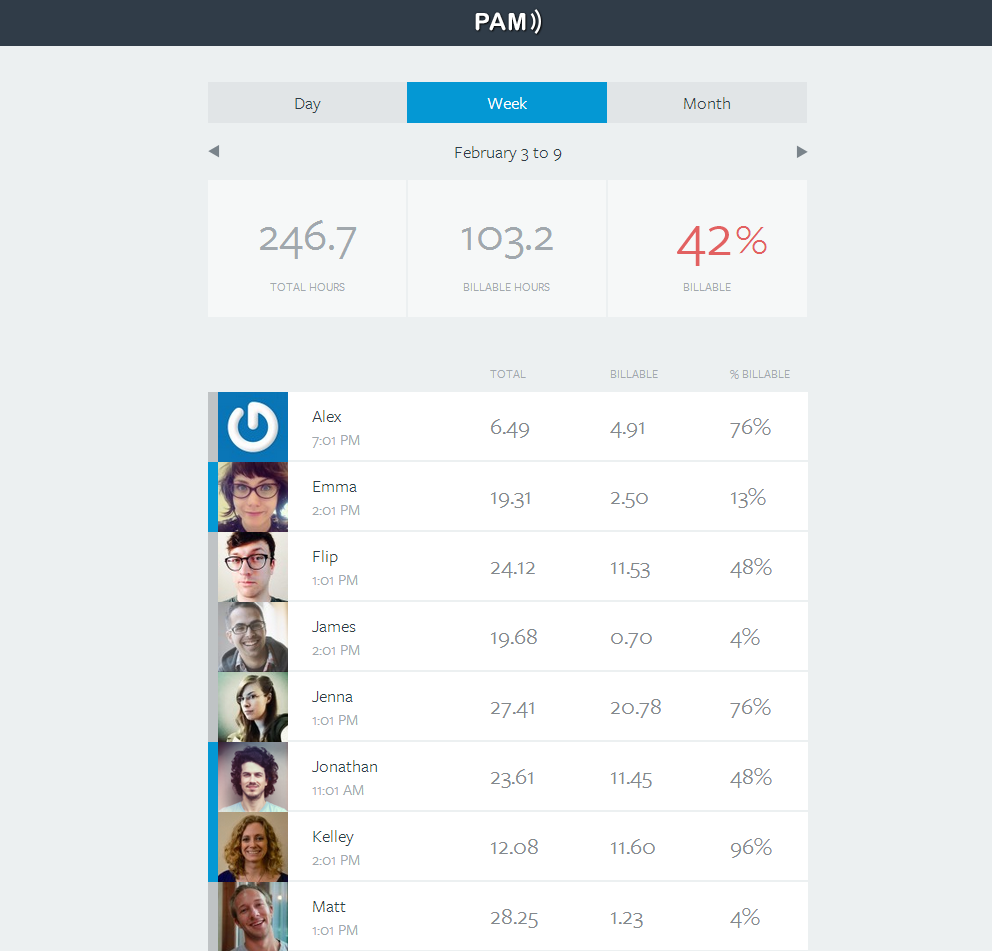

Phuse Activity Monitor (PAM) v.2.0
====================================

The Phuse Activity Monitor is the beginning of our team dashboard. As a remote team, we were looking for a way to keep everyone connected. As an entirely remote agency, we use Harvest to track our hours, and PAM gives us a way to see the working status and current hour count for everyone on the team. 

###Setup:
0. Install Node.js: http://nodejs.org/, Grunt: http://gruntjs.com/, and Heroku Toolbelt (if you're planning on doing deployment/hosting through Heroku): https://toolbelt.heroku.com/
1. Clone the GitHub repository.
2. Open a command prompt and `cd` to the repository's directory. Run `npm install` to install all the node packages needed for the PAM project.
3. Create a config.json file (see below) with your Harvest credentials. Don't commit this file. ;)
4. Run `node server` from the command prompt to get the node server up an running. You should see the message `Listening on 1234`.
5. Open a new command prompt and run `grunt watch`. Grunt was installed when you ran `npm install` in step 2.
6. Go to http://127.0.0.1:1234 (or http://localhost:1234) in your browser, and voila!

###config.json
This file is required *locally* to connect to Harvest API to gather data. PAM is set up to connect to one Harvest administrator account, and gather all user data from there. The Harvest account to which you're connecting must have high enough permissions to see everyone's hours.

Finding these variables in Harvest is a bit tricky. The client ID and secret key settings can be found by clicking your **avatar** in the top right of the screen, going to the **Account Settings** page, scrolling down to the **Integrations** section, clicking **OAuth2 Clients** and creating a **New Client**. As an example, here are the values that we use for our TWO instances of PAM, the first is the localhost instance:

    App Name: PAM (Localhost)
    Website URL: http://pam.thephuse.com/
    Redirect URI: http://127.0.0.1:1234/auth/harvest/callback

and the second is the production instance hosted on Heroku:

    App Name: PAM (pam.thephuse.com)
    Website URL: http://pam.thephuse.com/
    Redirect URI: http://pam.thephuse.com/auth/harvest/callback

When you click create you'll be redirected to a page with auto-generated **Client Parameters**. With this information in hand, create a `config.json` file that contains the following:

    {
      "harvest_username" : // Harvest admin username
      "harvest_password" : // Harvest admin password
      "harvest_webaddress": // Your team's URL at Harvest, e.g. 'https://thephuse.harvestapp.com/', with the trailing slash
      "local_rooturl": "http://127.0.0.1:1234/"
      "local_harvest_clientsecret": // Harvest Client Secret key (89-character key)
      "local_harvest_clientid": // Harvest Client ID (25-character key)
      "secret_session": // A random string to protect the session cookie, for example 'keyboard cat' (see below)
    }

The `secret_session` variable is simply a random string to be used to prevent tampering with the session cookie. Go ahead and write a random string here. See the documentation here: http://www.senchalabs.org/connect/session.html#session

These variables can be stored on Heroku as environment variables for better security.

###Environment Variables

The Heroku instance of PAM has a number of environment variables (or 'config variables') that hold the same data as the `config.json` file above. If you are creating a new Heroku project for PAM, you will need to set these environment variables.

The heroku documentation on setting config variables can be found here: https://devcenter.heroku.com/articles/config-vars

The following variables are needed for PAM, and can be set by running the following commands:

      heroku config:set HARVEST_USERNAME=
      heroku config:set HARVEST_PASSWORD=
      heroku config:set HARVEST_WEBADDRESS=
      heroku config:set ROOT_URL="http://127.0.0.1:1234/"
      heroku config:set HARVEST_CLIENTID=
      heroku config:set HARVEST_SECRET=
      heroku config:set SECRET_SESSION=

###Deployment

At The Phuse, we use Heroku to host PAM for our team. Heroku has a wealth of documentation on how to setup their command line interface (https://toolbelt.herokuapp.com/) and deploy code to heroku from Git or SVN (https://devcenter.heroku.com/articles/git).

If you are deploying to an exising project, such as our instance of PAM, use the following steps:
1. Contact James to get yourself added as contributor
2. From your local PAM directory, run `heroku git:remote -a phusepam2` from the command line.
3. To build your code for production, run `grunt` from the command line.
4. Deploy your code: `git push heroku master && heroku ps:scale web=1`
5. Running `heroku open` from the command line will open the site. Alternatively, go to [phusepam2.herokuapp.com](http://phusepam2.herokuapp.com/)

###Tech:
- Node.js (with Express.js) in the back
- Backbone.js in the front
- Use express routing to map harvest api
- Consume data from said routes in Backbone
- Scss and CoffeeScript, compiled using Grunt